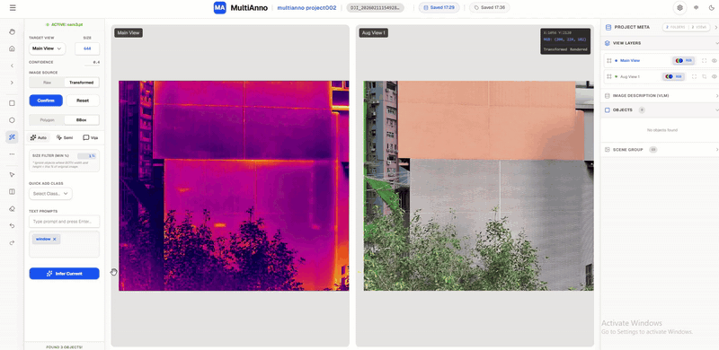

# MultiAnno
[English](README.md) | [简体中文](README_zh-CN.md)

[]([https://reactjs.org/](https://reactjs.org/))
[](https://fastapi.tiangolo.com/)

**MultiAnno: An AI-assisted image annotation tool for multi-view tasks.**

> **A Special Note:** The core architecture and codebase of this project were developed with the pair-programming assistance of **Google Gemini 3.1 Pro**. 

---


## Key Features

### Multi-View Sync
MultiAnno supports the simultaneous, synchronized viewing of multi-band and multi-modal imagery (e.g., RGB, Infrared, Depth). It features viewport and crosshair synchronization to facilitate comparative annotation across different views.

### AI-Assisted Annotation
Integrated with the Segment Anything Model (SAM 3). It supports generating polygons and masks via point and box prompts, reducing the need for manual outlining and improving annotation efficiency.

### Modular User Interface
Built with React, MultiAnno provides a clean and modular user interface. It includes Dark/Light theme switching and a consolidated right panel for tools and properties, designed to keep the main workspace clear for annotation tasks.

---

## Functions

For advanced features and detailed configurations, please refer to the specific module documentation:

* **[Project & Data Management](docs/project_management.md)**
* **[Taxonomy Dashboard](docs/taxonomy.md)**
* **[Annotation Tool](docs/annotation_tool.md)**
* **[Data Format Exchange](docs/data_format.md)**
* **[Local Visualization Engine](docs/visualization.md)**

---

## Installation

### 1. Clone the Repository
```bash
git clone https://github.com/huilin66/multianno.git
cd multianno
```

### 2. Install the Frontend
2.1 Install Node.js from the [Node.js Official Website](https://nodejs.org/en/download).

2.2 Install frontend dependencies.
```bash
cd frontend
npm install
cd ..
```

### 3. Install the Backend
3.1 Create and activate a Conda environment.
```bash
conda create -n multianno python=3.10
conda activate multianno
```

3.2 Install backend dependencies based on your hardware:

* **Option A: CPU Only (Basic Mode)**
    ```bash
    cd backend
    pip install -r requirements.txt
    cd ..
    ```
* **Option B: GPU Recommended (Full AI Mode with SAM 3)**
    First, install the specific version of PyTorch that matches your CUDA environment from the [PyTorch Previous Versions Page](https://pytorch.org/get-started/previous-versions/). Then, install the remaining dependencies:
    ```bash
    cd backend
    pip install -r requirements-gpu.txt
    cd ..
    ```

---

## Quick Start

MultiAnno provides an all-in-one launcher to simplify the startup process. Once your Conda environment is activated, simply run the following command from the project root:

```bash
python app.py
```

1. **Create a new project:**
   * Set up your project meta path.
   * Select your image folder(s) and corresponding views.
   * Define the view extent relationships.
2. **Manage your taxonomy:** Define your annotation classes and attributes.
3. **Annotate:** Draw your annotations on the synchronized image views.
4. **Export:** Export your annotations to standard formats.
5. **Visualize:** Visualize your annotations and multi-view results locally.

---

## Acknowledgments
I extend my heartfelt thanks to the developers and contributors of Ultralytics, SAM 3 (Segment Anything 3), and X-AnyLabeling. 

## License
MultiAnno operates under the terms of the [AGPL-3.0 License](./LICENSE). As a completely free and open-source initiative, this platform is dedicated to all developers and researchers. We hope it can serve as a practical infrastructure to support and advance your daily annotation workflows.

## Citing
If you use this software in your research, please cite it as below:
```bibtex
@misc{multianno,
  title={{MultiAnno: An AI-assisted image annotation tool for multi-view tasks}},
  author={Huilin ZHAO, Xing XU},
  year={2026},
  publisher={GitHub},
  howpublished={\url{https://github.com/huilin66/multianno}}
}
```